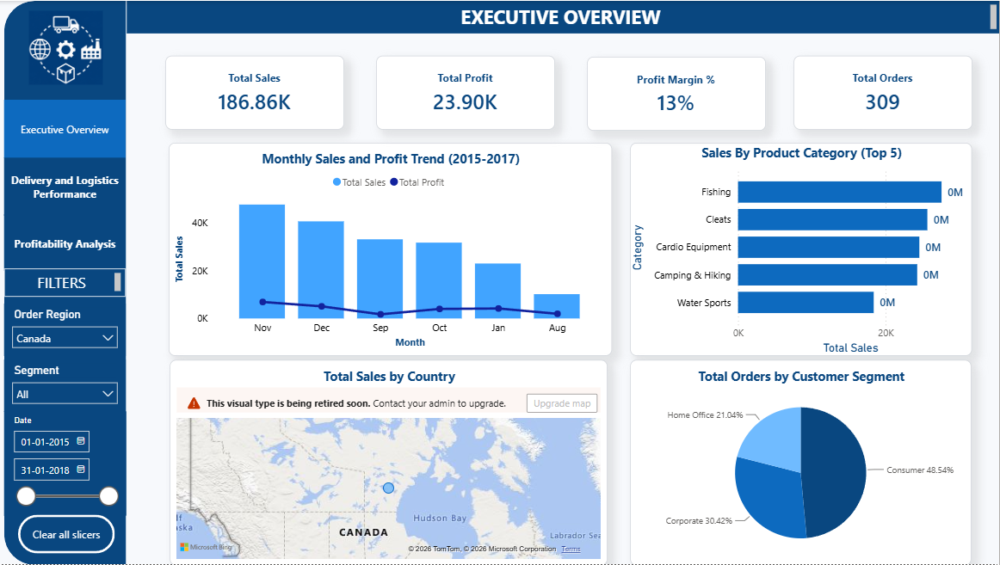
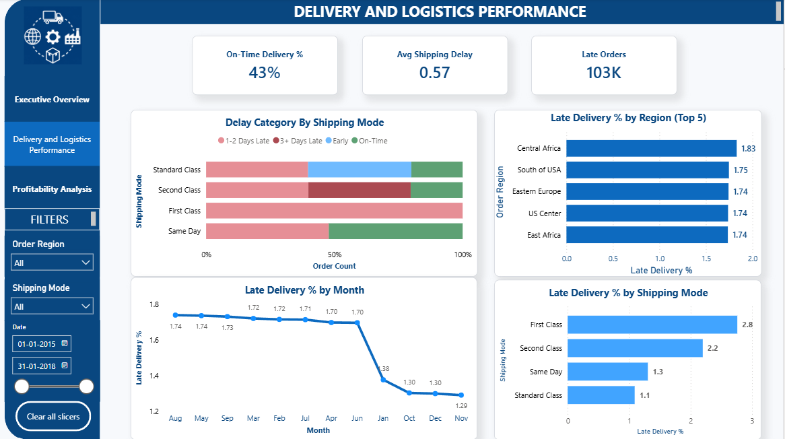
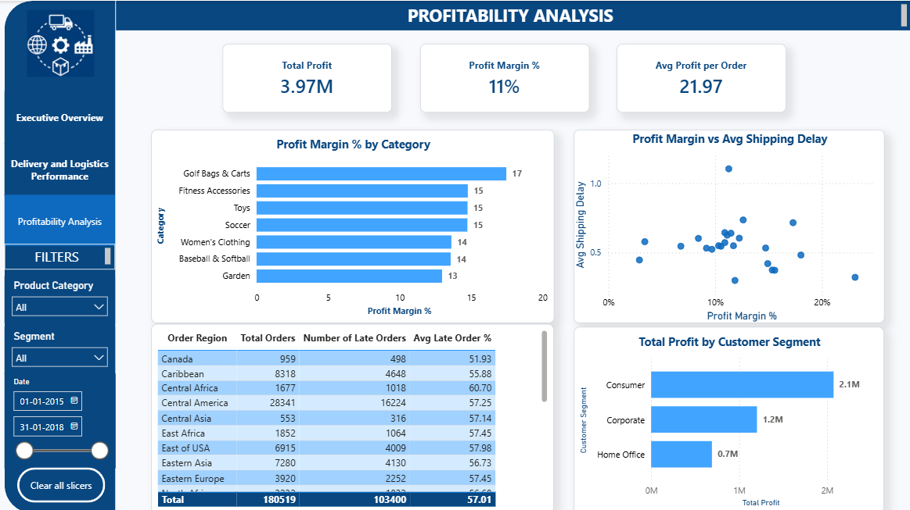

# Supply Chain & Delivery Performance Analytics

An end-to-end data analysis project examining delivery performance, profitability, and regional risk across a global supply chain built with Python, SQL Server, and Power BI.


---

## Problem Statement

Global supply chains generate huge volumes of order and shipping data, but raw transaction logs rarely answer the questions that matter to the business:

- Which shipping modes and regions consistently underperform on delivery time?
- Where is the company losing money, which product categories or customer segments carry negative margins?
- Does late delivery actually hurt customer satisfaction and profitability, or are they unrelated?

This project builds a full pipeline from raw flat-file data to a decision-ready dashboard to answer those questions with evidence, not guesswork.

---

## Architecture

```
Raw CSV (Kaggle) 
      │
      ▼
Python (pandas) — clean, feature-engineer, split into star schema
      │
      ▼
SQL Server — load fact/dimension tables, write analytical views (CTEs, window functions)
      │
      ▼
Power BI — data model, DAX measures, 3-page interactive dashboard
```

---

## Dataset

**[DataCo Smart Supply Chain Dataset](https://www.kaggle.com/datasets/shashwatwork/dataco-smart-supply-chain-for-big-data-analysis)** (Kaggle) — ~180,000 order records from a global retailer, 2015–2018, covering orders, shipping, products, customers, and profitability.

---

## Tech Stack

| Layer | Tools |
|---|---|
| Data cleaning & feature engineering | Python, pandas |
| Data loading | SQLAlchemy, pyodbc |
| Database | Microsoft SQL Server |
| Analysis | T-SQL — CTEs, window functions, aggregate views |
| Visualization | Power BI (DAX measures, star schema data model) |

---

## Data Model

A star schema built from the original flat file:

**Fact table:** `fact_orders` — one row per order line item, with delivery, sales, and profit metrics.

**Dimension tables:**
- `dim_customer`
- `dim_product`
- `dim_department`
- `dim_shipping`
- `dim_location`
- `dim_date`

**Aggregated analytical views** (SQL Server):
- `vw_monthly_trend` — monthly sales, profit, and late-order counts
- `vw_top_regions_late_delivery` — regions ranked by late-delivery %
- `vw_category_profit_summary` — profit and margin by product category

---

## Key Insights

!. Total Sales peaks during the first Quarter and then decreases gradually and takes a significant decrease in last two months.
2. Consumer segment contributes to 50% of the total sales.
3. Fishing, Cleats, Camping and hiking products contribute the most to the sales.
4. Central Africa and South of USA suffer high late Delivery %.
5. Late Delivery % decreases in the year end.
6. Standard Class has the least Late Delivery %.
7. Consumer Segment generates the highest profit.
8. Golf carts and Fitness Accessories have the best Profit margin %.


---

## Dashboard Preview

### Page 1 — Executive Overview


### Page 2 — Delivery & Logistics Performance


### Page 3 — Profitability Analysis


---

## Repository Structure

```
├── notebooks/
│   └── data_cleaning_feature_engineering.ipynb   # Python: clean, engineer features, build star schema
├── sql/
│   ├── 01_sanity_checks.sql
│   ├── 02_core_view.sql
│   ├── 03_delivery_performance.sql
│   ├── 04_profitability.sql
│   ├── 05_regional_risk.sql
│   ├── 06_customer_behavior.sql
│   ├── 07_window_functions.sql
│   └── 08_powerbi_views.sql
├── powerbi/
│   ├── supply_chain_dashboard.pbix
│   └── screenshots/
└── README.md
```

---

## How to Reproduce

1. Download the dataset from Kaggle (link above) and place the CSV in a local `data/` folder.
2. Run `notebooks/data_cleaning_feature_engineering.ipynb` — cleans the data, engineers delivery/profit features, and splits it into fact/dimension tables.
3. Update the SQL Server connection string in the notebook with your own server/database details, then run the load cells to push the tables in.
4. Run the SQL scripts in `sql/` (in order) against your SQL Server database to create the analytical views.
5. Open `powerbi/supply_chain_dashboard.pbix` in Power BI Desktop, point the data source to your SQL Server instance, and refresh.

---

## Business Questions Answered

- How is revenue and profit trending month over month?
- Which shipping modes and regions have the worst on-time delivery performance?
- Which product categories and customer segments are most/least profitable?
- Is there a measurable relationship between shipping delay and profit margin?

---

## Author

Built as part of a data analyst / data engineer portfolio.
